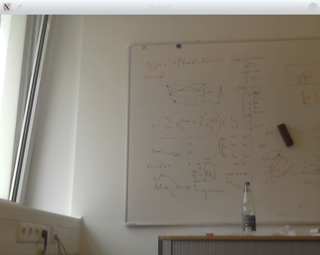
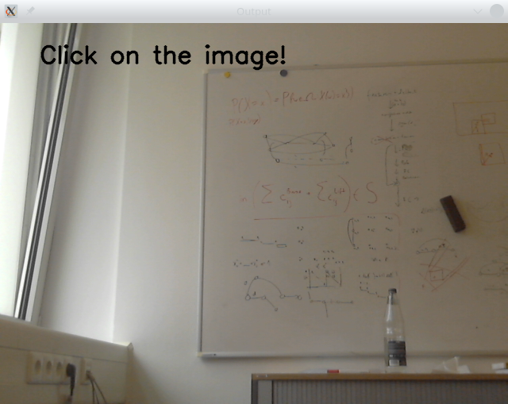
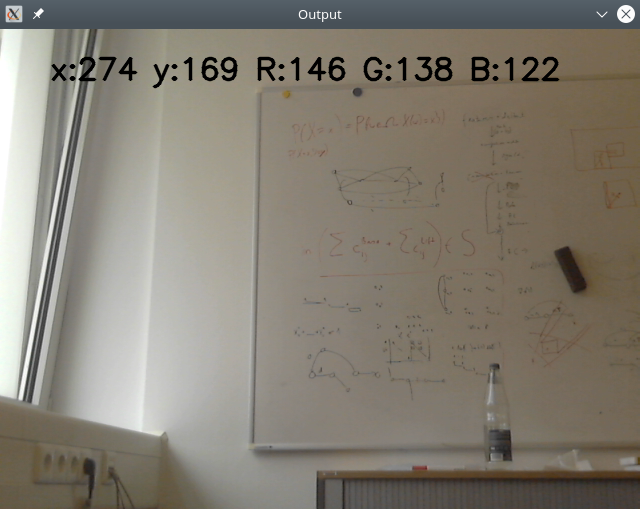

# Übung: CV-Application
Um diese Übung lösen zu können, lesen Sie das [README.md](README.md). 

In dieser Übung vollenden Sie ein Skript, mit dem ein bestimmtes Pixel eines Bildes ausgewählt und dessen RGB-Werte angezeigt
werden können. Für diese Übung werden die Dateien [algorithms/tutorial_algorithm.py](algorithms/tutorial_algorithm.py) und
 [algorithms/\_\_init\_\_.py](./algorithms/__init__.py) modifiziert. Die Musterlösung für die Übung findet sich in der Datei
 [algorithms/tutorial_algorithm_solution.py](./algorithms/tutorial_algorithm_solution.py).


## a) Einbinden des Algorithmus
Öffnen Sie die Datei [algorithms/\_\_init\_\_.py](./algorithms/__init__.py). Der Inhalt wird ungefähr wie der folgende 
Code-Snippet aussehen:

```python
class Algorithm:
    """ An abstract class to create custom algorithms """
    def process(self, img):
        """ Processes the input image"""
        return img

    def mouse_callback(self, event, x, y, flags, param):
        """ Reacts on mouse callbacks """
        return


''' Import algorithms to use'''
from .image_to_gray import ImageToGray
from .image_to_hue import ImageToHue
from .motion_detector import MotionDetector
from .white_balancing import WhiteBalancing
from .spin import Spin
from .segmentation_tracker import SegmentationTracker

''' Link Algorithms to keys '''
algorithms = dict()
algorithms["0"] = Algorithm
algorithms["1"] = ImageToGray
algorithms["2"] = ImageToHue
algorithms["3"] = MotionDetector
algorithms["4"] = WhiteBalancing
algorithms["5"] = Spin
algorithms["6"] = SegmentationTracker
```

Ihre Aufgabe ist es nun, den Algorithmus ``TutorialAlgorithm`` zu importieren und der Taste **7** zuzuordnen.

## b) Vervollständigen des Scripts
Öffnen Sie das Skript [algorithms/tutorial_algorithm.py](./algorithms/tutorial_algorithm.py). Der Inhalt der Datei ähnelt dem
folgenden Code-Snippet:

```python
import cv2

from . import Algorithm


class TutorialAlgorithm(Algorithm):
    """ Writes the RGB values of an pixel to the output image """

    def __init__(self):
        """ Init reference point with None value """
        ### 1) INSERT self.pos ###

    def process(self, img):
        """
        Reads out the RGB values of the reference point and writes it to the output image
        """
        if self.pos is not None:
            pixel = img[self.pos[1], self.pos[0]]
            text = "x:%s y:%s R:%s G:%s B:%s" % (self.pos[0], self.pos[1], pixel[2], pixel[1], pixel[0])
        else:
            text = "Click on the image!"
        font, org, font_scale, color, thickness = cv2.FONT_HERSHEY_SIMPLEX, (50, 50), 1, (0, 0, 0), 2
        image = cv2.putText(img, text, org, font, font_scale, color, thickness, cv2.LINE_AA)

        return image

    def mouse_callback(self, event, x, y, flags, param):
        """ Selects a new reference position"""
        if event == cv2.EVENT_LBUTTONUP:
            # Store x and y to the member value self.pos
            ### 2) UPDATE self.pos ###

```

Zu sehen ist eine Klasse Namens ``TutorialAlgorithm``, welche aus der Klasse ``Algorithm`` abgeleitet wurde. Zu sehen sind
die drei vordefinierten Funktionen ``__init__(self)``, ``process(self, img)`` und 
``def mouse_callback(self, event, x, y, flags, param)`` (siehe [README.md](README.md))

Die Funktion ``process(self, img)`` ist bereits fertig implementiert und schreibt einen Text auf das Eingangsbild. Sie 
greift auf die Variable ``self.pos`` zu, die bisher noch nicht definiert ist.

Definieren Sie die Member-Variable ``self.pos`` in der Funktion ``__init__(self)`` und weisen Sie ihr den initialen Wert
*None* zu. Dafür vorgesehen ist die Zeile mit dem Inhalt ```### 1) INSERT self.pos ###```.

Nun soll die Variable bei jedem Mausklick mit einem neuen Wert überschrieben werden. Speichern Sie bei jedem Mausklick 
die x und y Werte als Tupel ``(x, y)`` in die Variable ``self.None``. Dafür vorgesehen ist die Zeile mit dem Inhalt 
``### 2) UPDATE self.pos ###``.

Das Programm ist nun einsatzbereit. 

## c) Ausführen des Skripts

Führen Sie das Skript `main.py` aus diesem Verzeichnis mit dem Befehl

```bash
python main.py --mode=screen
```
aus. Nach dem das Skript gestartet wurde, drücken Sie die Taste **7**, um Ihren Algorithmus zu aktivieren. Klicken Sie 
dann mit der Maustaste auf eine beliebige Stelle des Bildes. Nach dem Klick sollten die RGB-Werte der gewählten Position 
ausgegeben werden.

Die folgenden Abbildungen visualisieren einen beispielhaften Output aus dem Skript.

Nach Start des Programms | Nach Betätigen der Taste **7** | Nach dem Klick auf das Bild
:-------------------------:|:-------------------------:|:-------------------------:
  |   | 